# 🏥 StrokeWatch Documentation

### Comprehensive System Documentation & Testing Guide

---

## 📑 Table of Contents

<div class="grid grid-cols-2 gap-4">

### Core Documentation

1. [📋 Project Overview](#1-project-overview)
2. [🏗 Technical Architecture](#2-technical-architecture)
3. [⚙️ Setup & Installation](#3-setup-and-installation)
4. [🔌 API Integration](#4-api-integration)
5. [💾 Database Design](#5-database-design)
6. [🛠 Core Features](#6-core-features)
7. [📅 Data Analysis](#7-dataset-analysis)
8. [🧠 Machine Learning](#8-machine-learning)

### Technical Details

8. [🔒 Security Implementation](#9-security-implementation)
9. [🧪 Testing & Quality Assurance](#10-testing-&-quality-assurance)
10. [📁 Code Structure](#11-code-structure)
11. [❌ Error Handling](#12-error-handling)
12. [⚠️ Known Issues](#13-known-issues)
13. [🚀 Future Improvements](#14-future-improvements)

</div>

---

## 1. Project Overview

### 1.1 Introduction

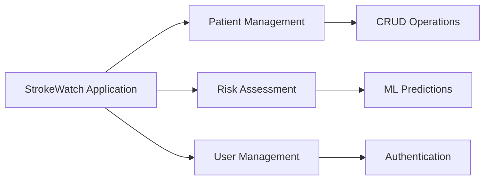
```mermaid
graph LR
    A[StrokeWatch Application] --> B[Patient Management]
    A --> C[Risk Assessment]
    A --> D[User Management]
    B --> E[CRUD Operations]
    C --> F[ML Predictions]
    D --> G[Authentication]
```

StrokeWatch combines web technologies with machine learning for healthcare stroke risk assessment and patient management.

### 1.2 Core Features

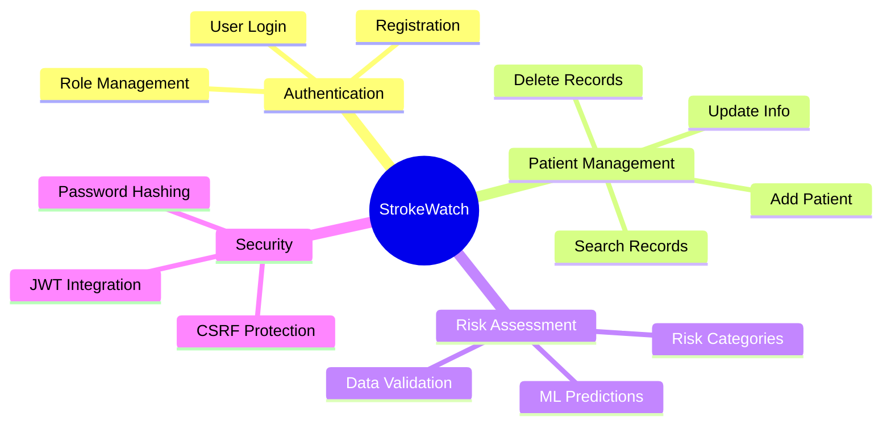
```mermaid
mindmap
  root((StrokeWatch))
    Authentication
      User Login
      Registration
      Role Management
    Patient Management
      Add Patient
      Search Records
      Update Info
      Delete Records
    Risk Assessment
      ML Predictions
      Risk Categories
      Data Validation
    Security
      CSRF Protection
      Password Hashing
      JWT Integration
```

### 1.3 Tech Stack Overview

<div class="grid grid-cols-2 gap-4">

#### Backend Components

- 🔷 Flask 3.1.0
- 🔶 SQLAlchemy 3.1.1
- 🔷 MongoEngine 0.29.1
- 🔶 TensorFlow 2.18.0
- 🔷 Keras 3.6.0

#### Security Components

- 🛡️ Flask-JWT-Extended 4.6.0
- 🔑 Flask-Login 0.6.3
- 🔐 Flask-Bcrypt 1.0.1
- 🛡️ Flask-WTF 1.2.2

</div>

---

## 2. Technical Architecture

### 2.1 System Architecture

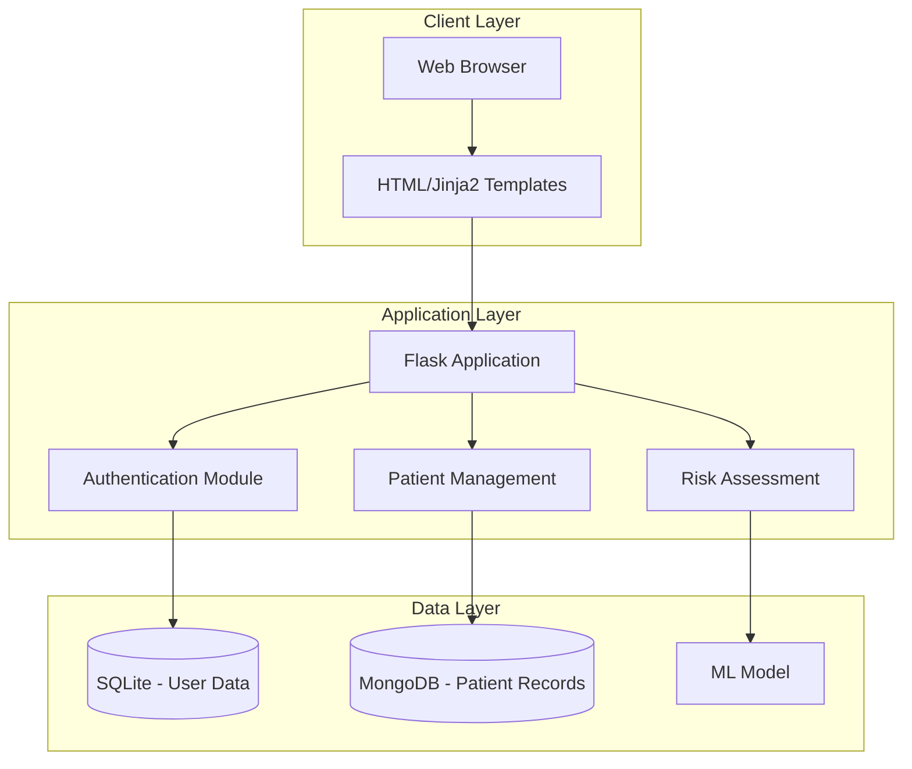
```mermaid
flowchart TD
    subgraph Client Layer
    A[Web Browser] --> B[HTML/Jinja2 Templates]
    end

    subgraph Application Layer
    B --> C[Flask Application]
    C --> D[Authentication Module]
    C --> E[Patient Management]
    C --> F[Risk Assessment]
    end

    subgraph Data Layer
    D --> G[(SQLite - User Data)]
    E --> H[(MongoDB - Patient Records)]
    F --> I[ML Model]
    end
```

### 2.2 Authentication Flow

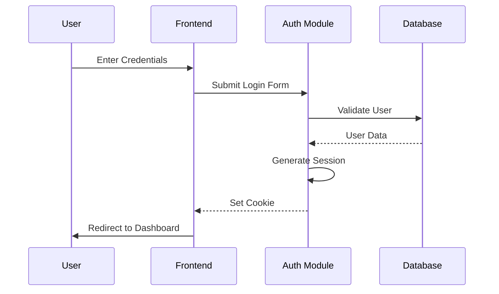
```mermaid
sequenceDiagram
    participant U as User
    participant F as Frontend
    participant A as Auth Module
    participant DB as Database

    U->>F: Enter Credentials
    F->>A: Submit Login Form
    A->>DB: Validate User
    DB-->>A: User Data
    A->>A: Generate Session
    A-->>F: Set Cookie
    F->>U: Redirect to Dashboard
```

---

## 3. Setup and Installation

### Environment Setup

```bash
# Clone repository
git clone https://github.com/CS-LTU/com7033-assignment-MRAWAISANWAR.git

# Create virtual environment
python -m venv venv
source venv/bin/activate  # Unix
venv\Scripts\activate     # Windows

# Install dependencies
pip install -r requirements.txt
```

### Configuration

##### Add following to .env file:

```ini
FLASK_ENV=development
SECRET_KEY=your_secret_key
MONGO_URI=mongodb://localhost:27017/stroke_prediction
SQLITE_DATABASE_URI=sqlite:///stroke_prediction.db
```

---

## 4. API Integration

### Authentication Endpoints

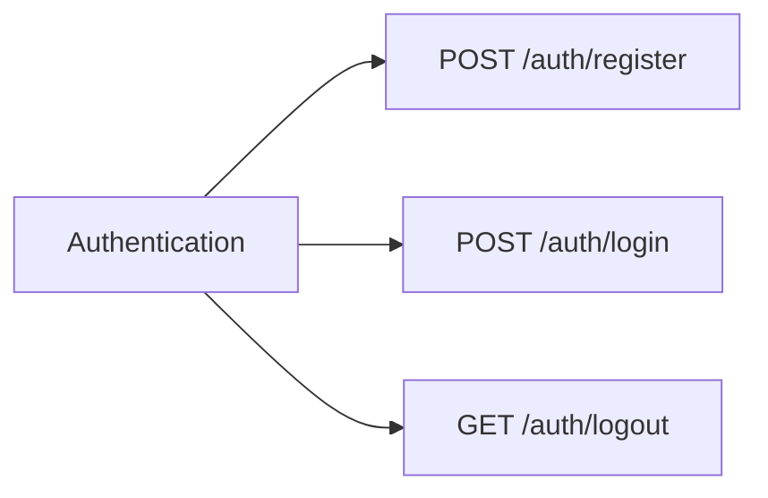
```mermaid
graph LR
    A[Authentication] --> B[POST /auth/register]
    A --> C[POST /auth/login]
    A --> D[GET /auth/logout]
```

### Patient Management Endpoints

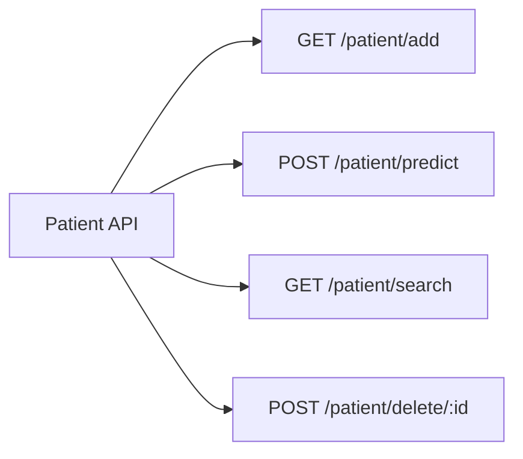
```mermaid
graph LR
    A[Patient API] --> B[GET /patient/add]
    A --> C[POST /patient/predict]
    A --> D[GET /patient/search]
    A --> E[POST /patient/delete/:id]
```

#### Example Requests

##### Register User

```http
POST /auth/register
Content-Type: application/json

{
    "name": "John Doe",
    "email": "john@example.com",
    "password": "secure_password",
    "role": "doctor"
}
```

##### Add Patient

```http
POST /patient/predict
Content-Type: application/json

{
    "name": "Patient Name",
    "age": 45,
    "gender": "Male",
    "hypertension": "1",
    ...
}
```

---

## 5. Database Design

### User Schema (SQLite)

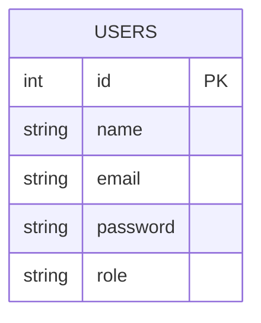
```mermaid
erDiagram
    USERS {
        int id PK
        string name
        string email
        string password
        string role
    }
```

### Patient Schema (MongoDB)

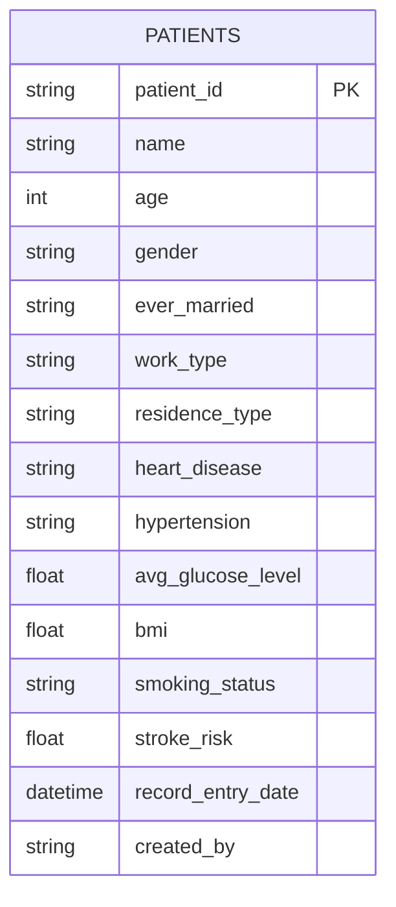
```mermaid
erDiagram
    PATIENTS {
        string patient_id PK
        string name
        int age
        string gender
        string ever_married
        string work_type
        string residence_type
        string heart_disease
        string hypertension
        float avg_glucose_level
        float bmi
        string smoking_status
        float stroke_risk
        datetime record_entry_date
        string created_by
    }
```

## 6. Core Features

### 6.1 User Management

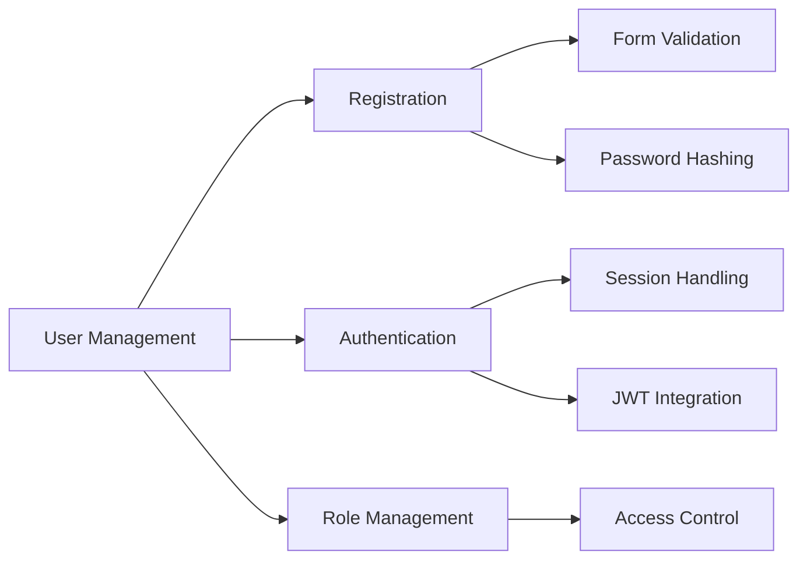
```mermaid
flowchart LR
    A[User Management] --> B[Registration]
    A --> C[Authentication]
    A --> D[Role Management]
    B --> E[Form Validation]
    B --> F[Password Hashing]
    C --> G[Session Handling]
    C --> H[JWT Integration]
    D --> I[Access Control]
```

#### User Model Implementation

```python
class User(db.Model, UserMixin):
    id = db.Column(db.Integer, primary_key=True)
    name = db.Column(db.String(150), nullable=False)
    email = db.Column(db.String(150), unique=True)
    password = db.Column(db.String(150), nullable=False)
    role = db.Column(db.String(50), default="doctor")
```

### 6.2 Patient Management

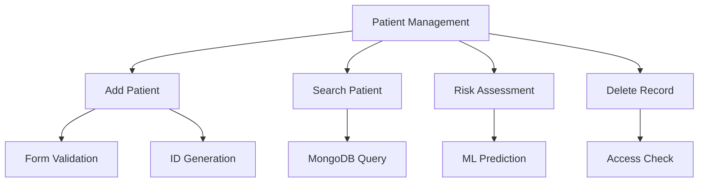
```mermaid
flowchart TD
    A[Patient Management] --> B[Add Patient]
    A --> C[Search Patient]
    A --> D[Risk Assessment]
    A --> E[Delete Record]

    B --> F[Form Validation]
    B --> G[ID Generation]
    C --> H[MongoDB Query]
    D --> I[ML Prediction]
    E --> J[Access Check]
```

---

## 7. Dataset Analysis

### 7.1 Dataset Analysis

###### (Provided Dataset was highly imbalanced)

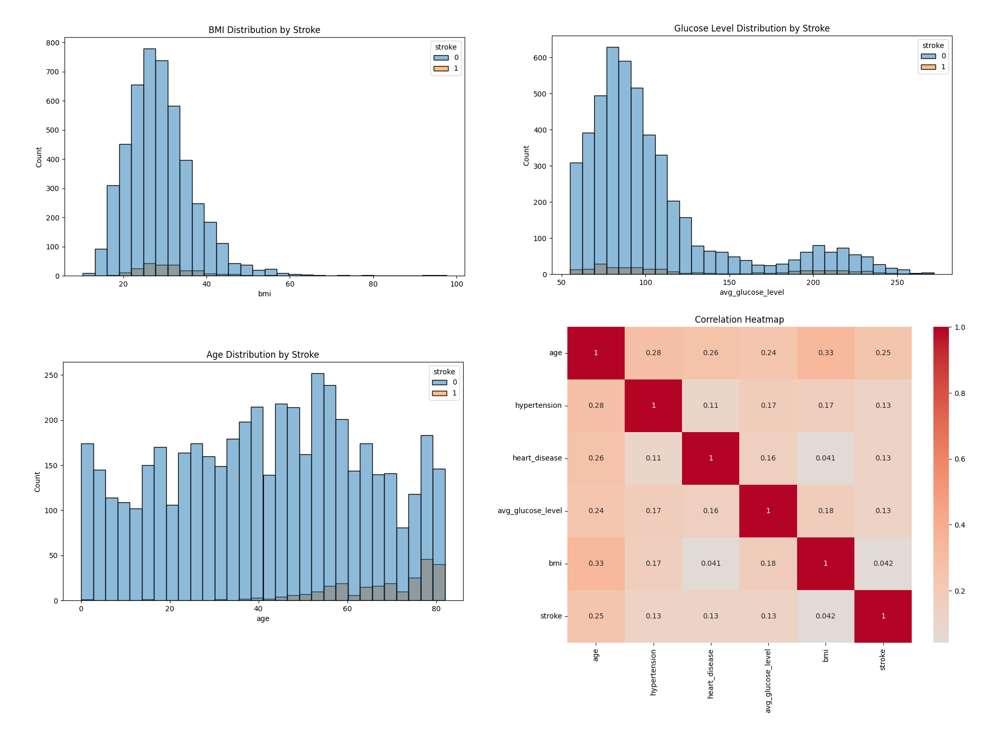
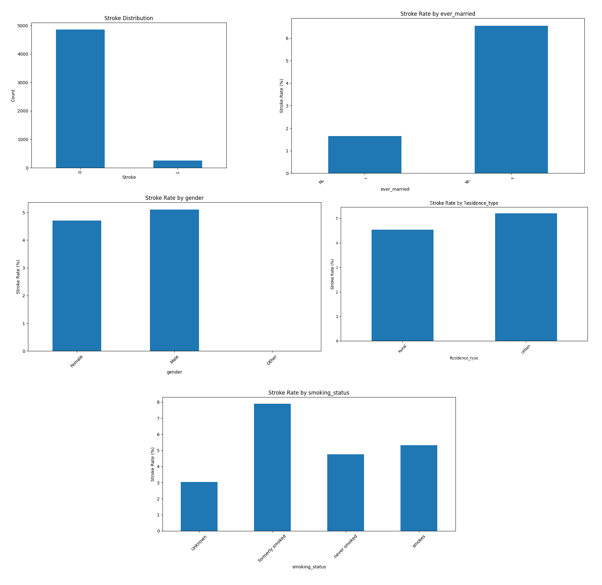

### 7.2 Processed Dataset Analysis

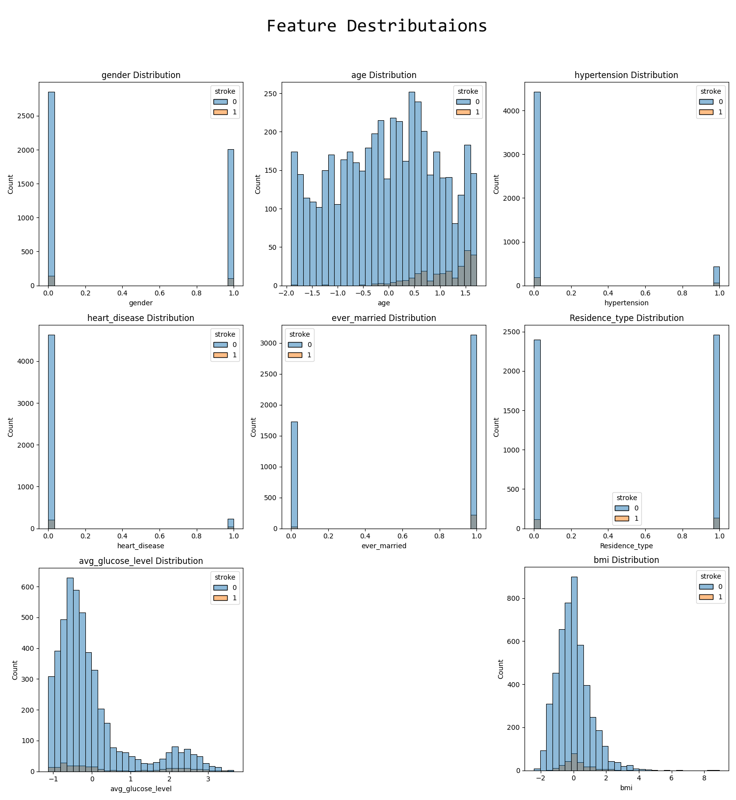
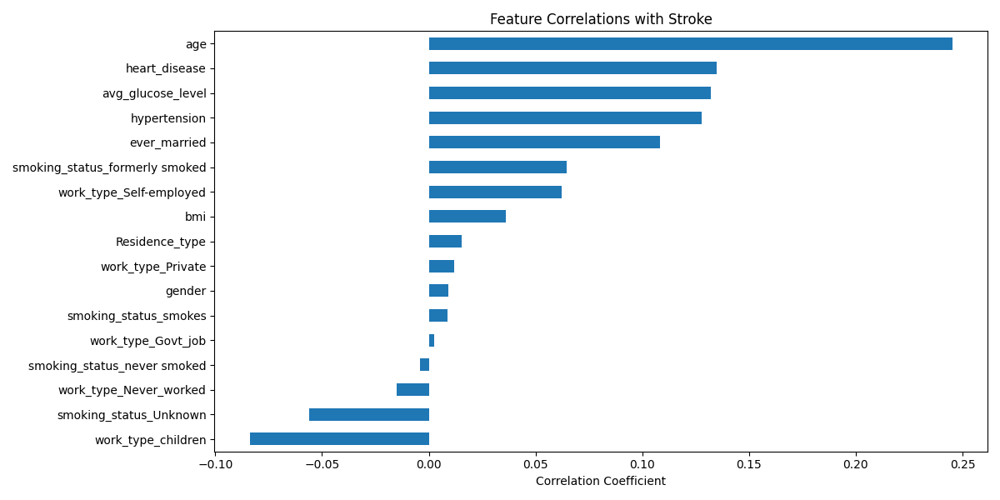

---

## 8. Machine Learning

### 8.1 Model Architecture

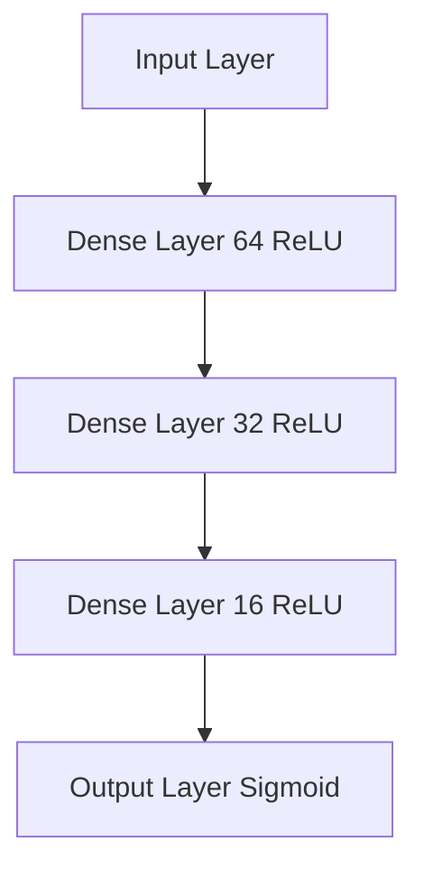
```mermaid
graph TD
    A[Input Layer] --> B[Dense Layer 64 ReLU]
    B --> C[Dense Layer 32 ReLU]
    C --> D[Dense Layer 16 ReLU]
    D --> E[Output Layer Sigmoid]
```

### 8.2 Feature Processing Pipeline

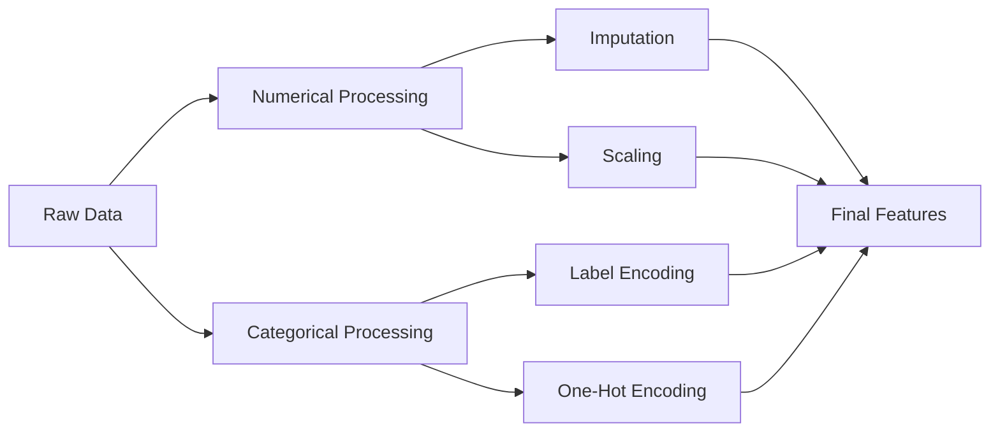
```mermaid
flowchart LR
    A[Raw Data] --> B[Numerical Processing]
    A --> C[Categorical Processing]
    B --> D[Imputation]
    B --> E[Scaling]
    C --> F[Label Encoding]
    C --> G[One-Hot Encoding]
    D --> H[Final Features]
    E --> H
    F --> H
    G --> H
```

### 8.3 Model Performance

#### Model Evaluation

```
    Accuracy:   69%
    AUC-ROC:    80%
    Precision:  98%
    Recall:     69%
    F1 Score:   81%
```

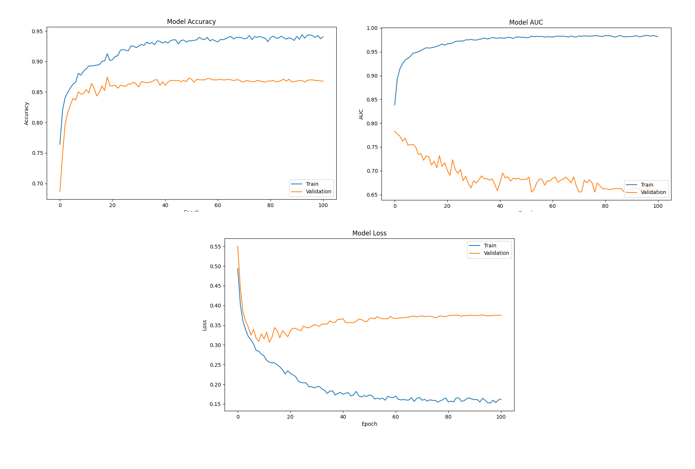

---

## 9. Security Implementation

### 9.1 Authentication Security

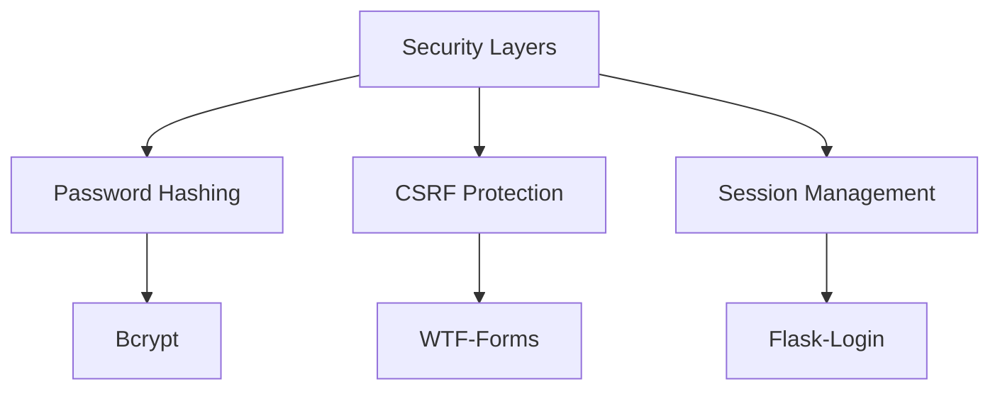
```mermaid
flowchart TD
    A[Security Layers] --> B[Password Hashing]
    A --> C[CSRF Protection]
    A --> D[Session Management]

    B --> E[Bcrypt]
    C --> F[WTF-Forms]
    D --> G[Flask-Login]
```

### 9.2 Data Protection

```python
# CSRF Protection Setup
app.config['WTF_CSRF_ENABLED'] = True
app.config['WTF_CSRF_TIME_LIMIT'] = 3600
app.config['WTF_CSRF_SSL_STRICT'] = True

# Password Hashing
def set_password(self, password):
    self.password = bcrypt.generate_password_hash(password).decode('utf-8')
```

---

## 10. Testing & Quality Assurance

### 10.1 Test Coverage Overview

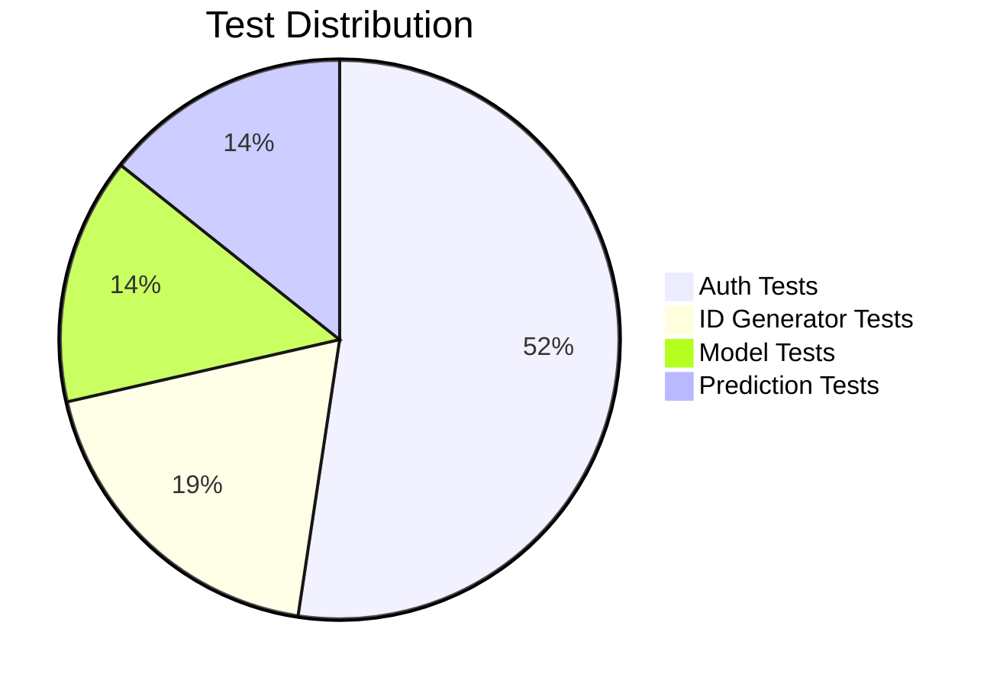
```mermaid
pie title Test Distribution
    "Auth Tests" : 11
    "ID Generator Tests" : 4
    "Model Tests" : 3
    "Prediction Tests" : 3
```

### 10.2 Test Categories

#### Authentication Testing

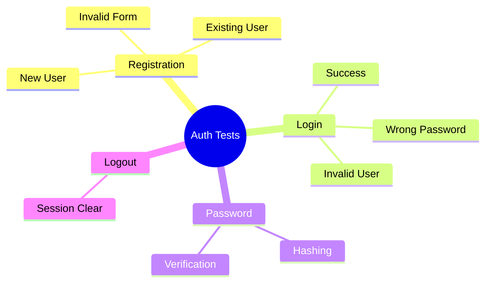
```mermaid
mindmap
    root((Auth Tests))
        Registration
            New User
            Existing User
            Invalid Form
        Login
            Success
            Wrong Password
            Invalid User
        Password
            Hashing
            Verification
        Logout
            Session Clear
```

#### Model Evaluation Testing

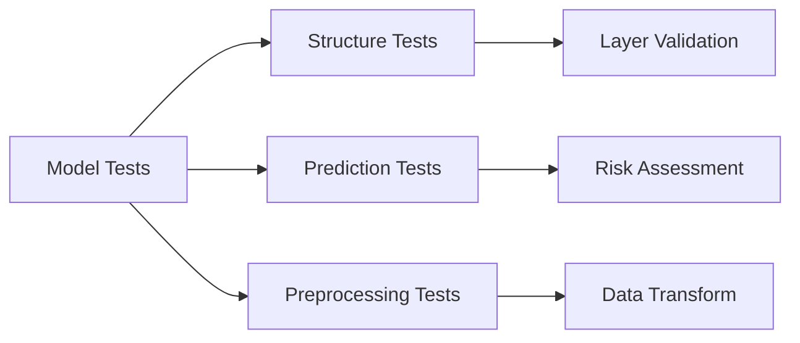
```mermaid
flowchart LR
    A[Model Tests] --> B[Structure Tests]
    A --> C[Prediction Tests]
    A --> D[Preprocessing Tests]
    B --> E[Layer Validation]
    C --> F[Risk Assessment]
    D --> G[Data Transform]
```

### 10.3 Test Results

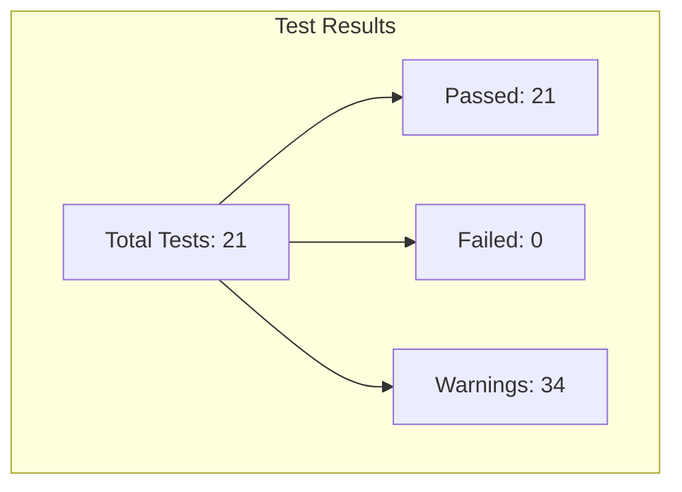
```mermaid
graph TD
    subgraph Test Results
    A[Total Tests: 21] --> B[Passed: 21]
    A --> C[Failed: 0]
    A --> D[Warnings: 34]
    end
```

---

## 11. Code Structure

### 11.1 Project Layout

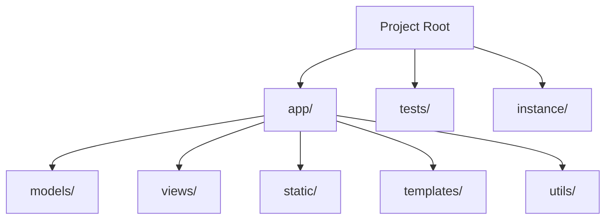
```mermaid
graph TD
    A[Project Root] --> B[app/]
    A --> C[tests/]
    A --> D[instance/]

    B --> E[models/]
    B --> F[views/]
    B --> G[static/]
    B --> H[templates/]
    B --> I[utils/]
```

### 11.2 Key Components

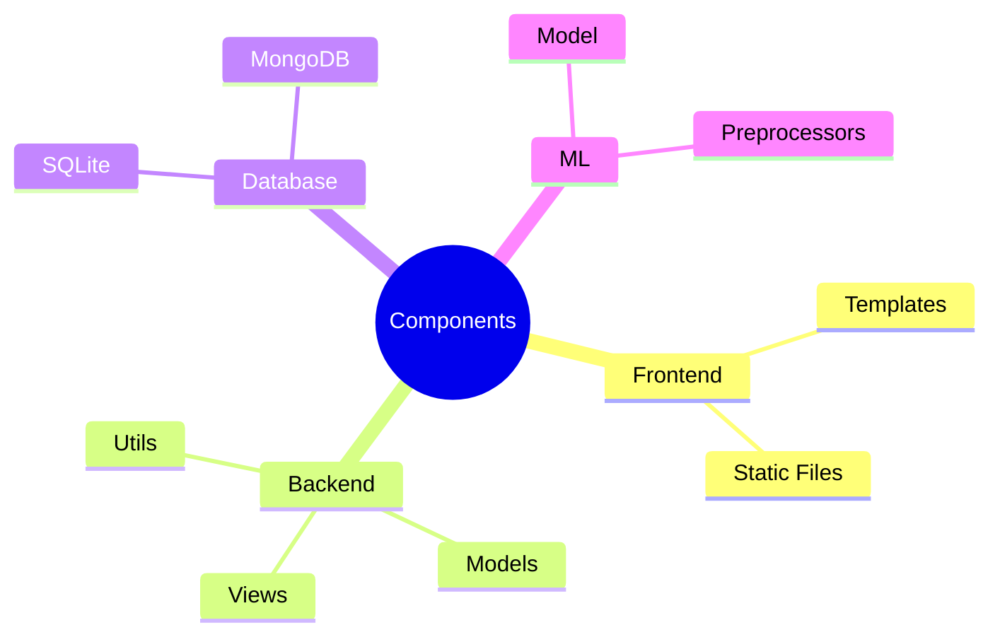
```mermaid
mindmap
    root((Components))
        Frontend
            Templates
            Static Files
        Backend
            Views
            Models
            Utils
        Database
            SQLite
            MongoDB
        ML
            Model
            Preprocessors
```

### 11.3 Detailed Structure

```
├── app/
│   ├── forms/
│   │   └── patient_form.py
│   ├── models/
│   │   ├── patient.py
│   │   └── user.py
│   ├── static/
│   │   ├── css/
│   │   │   ├── home.css
│   │   │   └── styles.css
│   │   ├── js/
│   │   │   ├── home.js
│   │   │   ├── main.js
│   │   │   ├── mainC..js
│   │   │   ├── mainO.js
│   │   │   └── patient.js
│   │   └── models/
│   │       ├── model_metrics.json
│   │       ├── preprocessors.pkl
│   │       ├── stroke_prediction_model_Best.keras
│   │       └── stroke_prediction_model_Final.keras
│   ├── templates/
│   │   ├── auth/
│   │   │   ├── login.html
│   │   │   └── register.html
│   │   ├── partials/
│   │   │   └── navbar.html
│   │   ├── patient/
│   │   │   └── add_patient.html
│   │   ├── profile/
│   │   │   └── settings.html
│   │   ├── base.html
│   │   ├── home.html
│   │   └── patient_details.html
│   ├── utils/
│   │   ├── decorators.py
│   │   ├── id_generator.py
│   │   └── prediction.py
│   ├── views/
│   │   ├── auth.py
│   │   ├── process_patient.py
│   │   └── profile.py
│   └── __init__.py
├── instance/
│   └── stroke_prediction.db
├── .env
├── InitializeSQLlite.py
├── MongoDB_Schema.py
└── run.py
```

---

## 12. Error Handling

### 12.1 Global Error Handlers

```python
@app.errorhandler(CSRFError)
def handle_csrf_error(e):
    return jsonify({
        "error": "CSRF token missing or invalid",
        "message": str(e)
    }), 400

@app.errorhandler(500)
def handle_server_error(e):
    return jsonify({
        "error": "Internal Server Error",
        "message": "An unexpected error occurred"
    }), 500
```

### 12.2 Error Flow

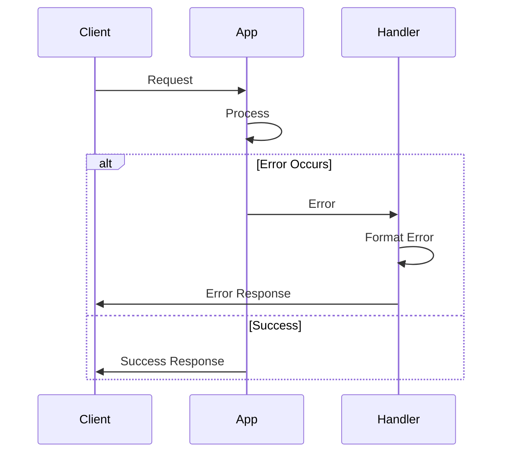
```mermaid
sequenceDiagram
    participant C as Client
    participant A as App
    participant H as Handler

    C->>A: Request
    A->>A: Process
    alt Error Occurs
        A->>H: Error
        H->>H: Format Error
        H->>C: Error Response
    else Success
        A->>C: Success Response
    end
```

---

## 13. Known Issues

### 13.1 Current Limitations

```mermaid
mindmap
    root((Known Issues))
        UI
            Toastify Issues
            Search Bar Navigation
        Features
            Limited Search
            Basic Reporting
```

---

## Additional Resources

### Quick Reference

- 📘 [API Documentation](#4-api-integration)
- 🔧 [Setup Guide](#3-setup-and-installation)
- 🧪 [Testing Guide](#10-testing-&-quality-assurance)
- ⚙️ [Configuration](#3-setup-and-installation)

### Contact

- 📧 Email Support: 2410816@leedstrinity.ac.uk
